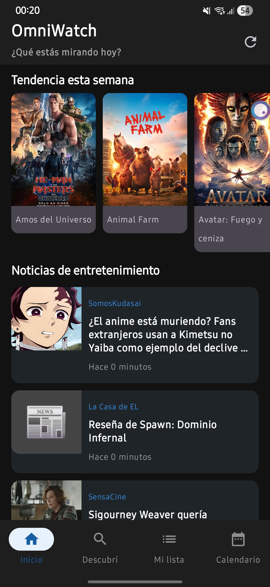
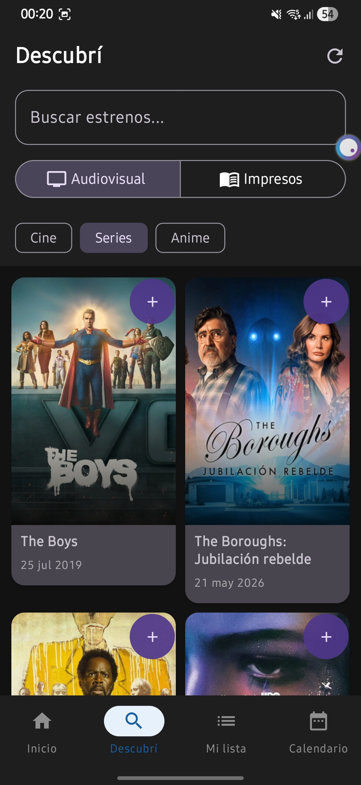
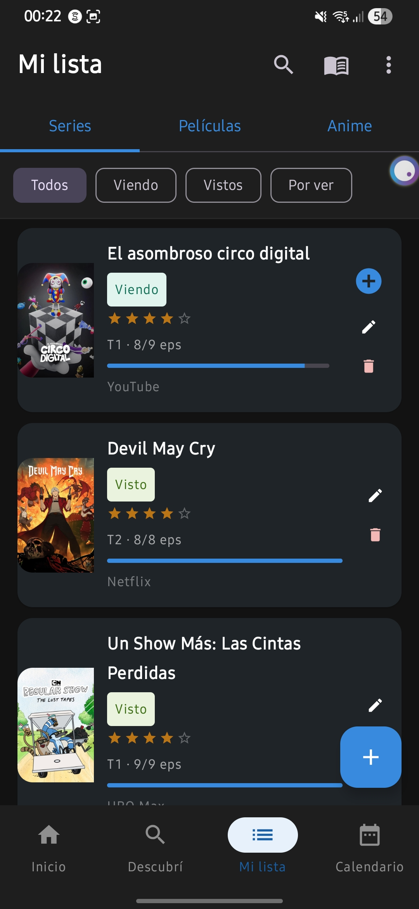
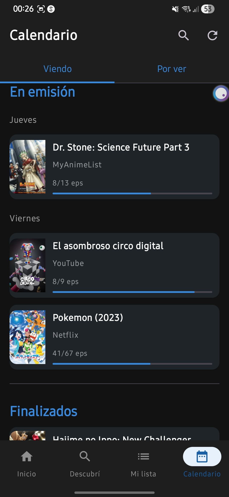

<p align="center">
  
</p>

# 👁️ OmniWatch - Track Your Media

OmniWatch es una aplicación nativa de Android diseñada para centralizar y organizar el seguimiento de Películas, Series y Animes. Desarrollada con un enfoque "Offline-First", permite a los usuarios gestionar sus listas personales, descubrir nuevos estrenos y llevar un calendario preciso de lanzamientos sin depender de una conexión constante a internet.

## ✨ Características Principales

<h2 align="center">📱 Vistazo a la App</h2>

<p align="center">
  
  &nbsp; &nbsp;
  
  &nbsp; &nbsp;
  
  &nbsp; &nbsp;
  
</p>

* **Gestión de Medios:** Organiza tu contenido en listas de estado ("Por ver", "Viendo", "Visto").
* **Calendario Inteligente:** Visualiza los próximos episodios y estrenos ordenados por fecha y día de la semana.
* **Soporte Multi-Plataforma:** Etiqueta en qué servicio de streaming (Netflix, Crunchyroll, Prime Video, etc.) estás viendo cada título.
* **Modo Oscuro Nativo:** Interfaz diseñada con Material Design 3, optimizada para la fatiga visual.

### 🚀 Novedades de la Discovery Update
* **Centro de Descubrimiento:** Nueva pestaña para explorar tendencias de Cine, Series y Anime integrando TMDB y Jikan (MyAnimeList) con memoria cache para uso offline.
* **Búsqueda Global Inteligente:** Buscador unificado con *Debounce* (Coroutines) que optimiza las llamadas a las APIs, filtrando resultados en tiempo real sin saturar la red.
* **Guardado Editable:** Tocando las tarjetas de los elemntos vamos a la pantalla _Agregar_ o _Editar_ (si ya esta guardado) con los datos de la tarjeta ya importados.
* **Quick Save (Guardado Rápido):** Guardado a un toque desde la pestaña "Descubrir", auto-completando y persistiendo fechas exactas de estreno y total de episodios.

---

## 🛠️ Stack Tecnológico y Arquitectura

El proyecto sigue los lineamientos recomendados por Google (Modern Android Development):

* **UI:** Jetpack Compose (100% declarativo) + Material Design 3.
* **Arquitectura:** MVVM (Model-View-ViewModel) + Clean Architecture principles.
* **Concurrencia y Estado:** Kotlin Coroutines & StateFlow.
* **Base de Datos Local:** Room Database (Offline-first approach).
* **Red:** Retrofit2 + OkHttp (Consumo de APIs REST: TMDB, Jikan, MyAnimeList Oficial).
* **Inyección de Dependencias:** Dagger Hilt.
* **Imágenes:** Coil (Carga asíncrona y caché de imágenes).

---

## 📂 Estructura del Proyecto

La aplicación está modularizada por capas (features) dentro del paquete `com.watchlist.app` para asegurar una clara separación de responsabilidades:

```text
📦 app/src/main/java/com/watchlist/app
 ┣ 📂 data
 ┃ ┣ 📂 local       # Entidades de Room, DAOs y Database
 ┃ ┣ 📂 remote      # Servicios de Retrofit (TMDB, Jikan, News) y Modelos DTO
 ┃ ┗ 📂 repository  # Única fuente de verdad (Single Source of Truth)
 ┣ 📂 di            # Módulos de Inyección de Dependencias (Hilt)
 ┣ 📂 navigation    # NavHost, Rutas y Configuración de Jetpack Navigation
 ┣ 📂 ui            # Pantallas (Screens) y componentes de UI
 ┃ ┣ 📂 addmedia
 ┃ ┣ 📂 calendar
 ┃ ┣ 📂 discovery
 ┃ ┣ 📂 home
 ┃ ┣ 📂 mylist
 ┃ ┗ 📂 theme       # Colores, Tipografías y Formas (Material 3)
 ┣ 📂 utils         # Clases de ayuda y formateadores (Ej: Fechas)
 ┗ 📂 viewmodel     # Lógica de presentación y manejo de estado (StateFlow)
```
---

## 📦 Descargar e Instalar (APK)

Podés probar la aplicación directamente en tu dispositivo Android (Requiere API 26+).
1. Ve a la sección de **[Releases](../../releases)** de este repositorio.
2. Descarga el archivo `OmniWatch-v1.1.apk`.
3. Instálalo en tu dispositivo (asegúrate de tener habilitada la instalación desde orígenes desconocidos).

---

## ⚙️ Configuración para Desarrolladores (Clonar y Compilar)

### 1. Configurar TMDB API Key (Pósters y Autocompletado)
Para proteger tus credenciales, la app lee las claves desde un archivo local que no se sube a GitHub.
1. Registrate en https://www.themoviedb.org/settings/api (es gratis).
2. Copiá tu **API Read Access Token** (el JWT largo).
3. En la raíz del proyecto, abrí (o creá) el archivo `local.properties`.
4. Agregá esta línea con tu token (sin comillas ni espacios raros):
```properties
TMDB_API_KEY=tu_token_jwt_largo_aqui
```
*(Nota: La API de Jikan para anime es pública y no requiere clave).*

### 2. Abrir el proyecto
1. Cloná este repositorio.
2. Abrí Android Studio y seleccioná **File → Open** (buscá la carpeta del proyecto).
3. Esperá que Gradle sincronice las dependencias.
4. Ejecutá en el emulador o dispositivo físico.

